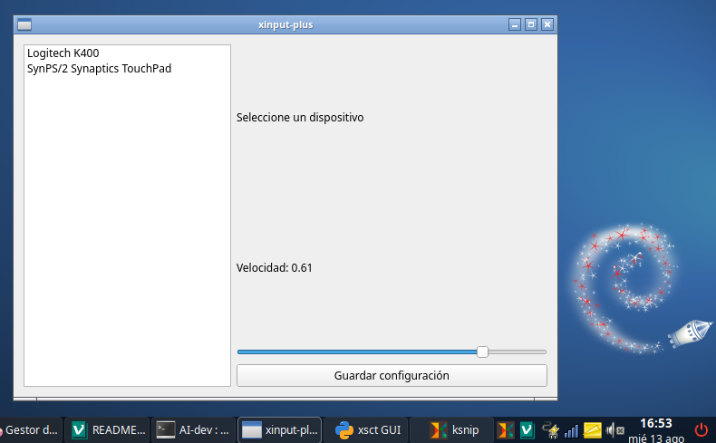

# 🖱️ xinput-plus

# Adjust your mouse or touchpad speed (very easy!)

This program is for **Linux** and allows you to **change the pointer speed** (mouse or touchpad cursor) graphically for use in X11 Window Managers such as: Openbox, JWM, iceWM, Fluxbox, and other minimalist window managers where there's no GUI program to do this, without having to type complicated commands. It's ideal if you use external keyboards that come with **integrated touchpad keyboard**, like the **Logitech K400**, or even for your laptop's touchpad if you feel the cursor moves too slowly.

---

## 🎯 What is it for?

- ✅ Increase or decrease mouse or touchpad speed.
- ✅ Save configuration so it doesn't get lost when restarting.
- ✅ Works with devices like:
  - Keyboards with touchpad (e.g.: Logitech K400)
  - USB mice
  - Laptop touchpads

---

## 🖥️ Requirements

Before using it, make sure you have the following installed on your Linux computer:

```bash
sudo apt install xinput git libinput-tools python3-pyqt6
```

1. ⚠️ This program only works on **X11**, not on Wayland.  
2. It's only for X11 WM like Openbox, JWM, iceWM, Fluxbox, Xubuntu, etc
3. In 2025, for example in GNOME, KDE, before logging in you can select X11 to enter instead of Wayland.

---

## 🚀 How to use the program

### **1st OPTION: Download the repository**
At:

[https://github.com/wachin/xinput-plus](https://github.com/wachin/xinput-plus)

click on the arrow-like dropdown in Code:

**<>  Code ▼**

and click on:

**Download ZIP**

decompress it, and there inside the folder is the `xinput-plus.py` file.

or you can clone it:

### **2nd OPTION: Clone the repository**

**1.-** Since we already have git installed, enter in a terminal in a folder where you have Linux programs:

```bash
git clone https://github.com/wachin/xinput-plus
```

**2.-** Give it execution permissions

It can be done by right-clicking in the **file manager** and in the "**Permissions**" tab verify that it's marked as executable

or from the terminal with:

```bash
chmod +x xinput-plus.py
```

## Running with Launcher.sh

Make sure the `Launcher.sh` script is executable, in the file manager right-click on it and in the "**Permissions**" tab make sure "**is executable**" is checked

Double-click the `Launcher.sh` script and click `Execute`

👉 A window will open with two controls:



## Running xinput-plus

**1.-** **Open a terminal**
**2.-** **Go to the folder** where the `xinput-plus.py` file is, or open a terminal there from your file manager
**3.-** **Run the program** with this command:

```bash
python3 xinput-plus.py
```

and it will open.

> 💡 On some Linux distributions you can right-click on the `xinput-plus.py` file and open with python.

---

## 🎛️ How to use it

1. When opening the program.
2. In the left list, **click on your device** (for example: "Logitech K400").
3. Use the slider to change the speed:
   - ← Slower
   - → Faster (up to 2 times faster!)
4. When you find the perfect speed, click **"Save configuration"**.

✅ Done! The change applies instantly and is saved for next time. But once you've turned on the computer again and opened the program, you must click on the window for the saved changes to be applied.

---

## 💾 Where is the configuration saved?

The program saves your settings in this file (don't delete it if you don't want to lose the configuration):

```
~/.config/libinput-gui.json
```

---

## 🤓 How does it work internally?

It uses Linux commands with `xinput` to change the device speed in real time.  
But to use it: the interface does everything for you!

---

## 🛠️ Want to improve this program?

This code is made in Python with PyQt6, perfect for students who want to learn about:
- Graphical interfaces
- Linux automation
- Hardware control

Feel free to modify it, improve it, or use it in your projects!

---

## 🙌 About this program

Created by: **Washington Indacochea Delgado**
License: **GNU GPL3** (free and open source)

✨ Thanks for using `xinput-plus`!  

For those who love X11 and minimalist window managers. 👀💙

---

> 🌟 If it helped you, give it a star ⭐ on GitHub. It helps a lot!

God bless you
