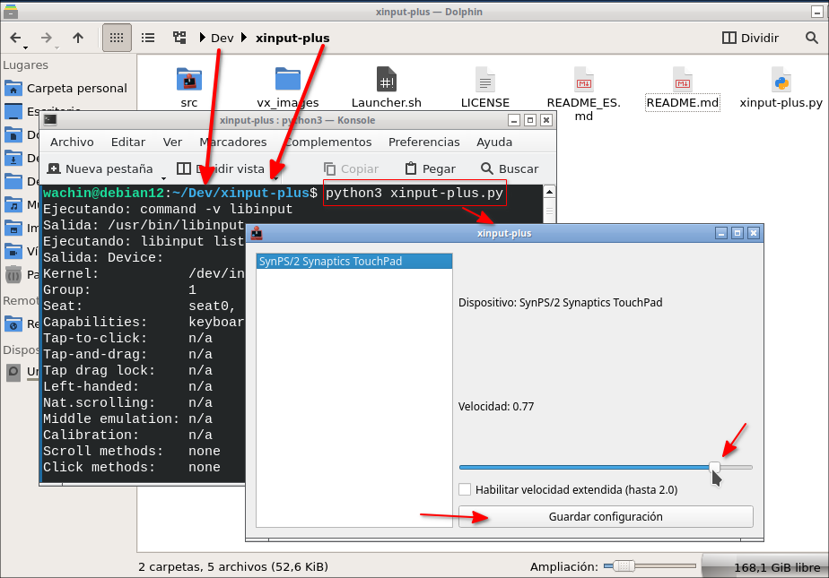

# 🖱️ xinput-plus

[](https://github.com/topics/linux)

# Adjust your mouse or touchpad speed (very easy!)

This program is for **Linux** and allows you to **change the pointer speed** (mouse or touchpad cursor) graphically for use in X11 Window Managers such as: Openbox, JWM, iceWM, Fluxbox, and other minimalist window managers where there's no GUI program to do this, without having to type complicated commands. It's ideal if you use external keyboards that come with **integrated touchpad keyboard**, like the **Logitech K400**, or even for your laptop's touchpad if you feel the cursor moves too slowly.

---

## 🎯 What is it for?

- ✅ Increase or decrease mouse or touchpad speed.
- ✅ Save configuration so it doesn't get lost when restarting.
- ✅ Works with devices like:
  - Keyboards with touchpad (e.g.: Logitech K400)
  - USB mice
  - Laptop touchpads

---

## 🖥️ Requirements

Before using it, make sure you have the following installed on your Linux computer:

```bash
sudo apt install xinput git libinput-tools python3-pyqt6 python3-simplejson libqt6svg6
```

1. ⚠️ This program only works on **X11**, not on Wayland.  
2. It's only for X11 WM like Openbox, JWM, iceWM, Fluxbox, Xubuntu, etc
3. In 2025, for example in GNOME, KDE, before logging in you can select X11 to enter instead of Wayland.

---

## 🚀 How to use the program

### **1st OPTION: Download the repository**
At:

[https://github.com/wachin/xinput-plus](https://github.com/wachin/xinput-plus)

click on the arrow-like dropdown in Code:

**<>  Code ▼**

and click on:

**Download ZIP**

decompress it, and there inside the folder is the `xinput-plus.py` file.

or you can clone it:

### **2nd OPTION: Clone the repository**

**1.-** Since we already have git installed, enter in a terminal in a folder where you have Linux programs:

```bash
git clone https://github.com/wachin/xinput-plus
```

**2.-** Give it execution permissions

It can be done by right-clicking in the **file manager** and in the "**Permissions**" tab verify that it's marked as executable

or from the terminal with:

```bash
chmod +x xinput-plus.py
```

## Running with Launcher.sh

Make sure the `Launcher.sh` script is executable, in the file manager right-click on it and in the "**Permissions**" tab make sure "**is executable**" is checked

Double-click the `Launcher.sh` script and click `Execute`

👉 A window will open with two controls:


## Running xinput-plus

**1.-** **Open a terminal**
**2.-** **Go to the folder** where the `xinput-plus.py` file is, or open a terminal there from your file manager
**3.-** **Run the program** with this command:

```bash
python3 xinput-plus.py
```

and it will open:



> 💡 On some Linux distributions you can right-click on the `xinput-plus.py` file and open with python.

---

## 🎛️ How to use it

1. When opening the program.
2. In the left list, **click on your device** (for example: "Logitech K400").
3. Use the slider to change the speed:
   - ← Slower (down to -1.0)
   - → Faster (up to 1.0 by default)
4. **Enable extended speed (optional)**: Check the box labeled "Enable extended speed (up to 2.0)" to allow the slider to go up to 2.0, which provides significantly faster cursor movement for devices like the Logitech K400. This mode uses the `Coordinate Transformation Matrix` to scale pointer movement beyond the standard range.
5. When you find the perfect speed, click **"Save configuration"**.

✅ Done! The change applies instantly and is saved for next time. The program remembers whether extended speed mode is enabled for each device. After restarting your computer, open the program, select your device, and the saved settings (including extended speed mode) will be applied automatically.

---

## 💾 Where is the configuration saved?

The program saves your settings in this file (don't delete it if you don't want to lose the configuration):

```
~/.config/xinput-plus.json
```

---

## 🤓 How does it work internally?

It uses Linux commands with `xinput` to change the device speed in real time. For standard speed adjustments, it modifies the `libinput Accel Speed` property. For extended speed mode (up to 2.0), it uses the `Coordinate Transformation Matrix` to scale pointer movement, allowing higher sensitivity for devices that need it. The interface does everything for you!

---

## 🛠️ Want to improve this program?

This code is made in Python with PyQt6, perfect for students who want to learn about:
- Graphical interfaces
- Linux automation
- Hardware control

Feel free to modify it, improve it, or use it in your projects!

---

## 🛑 Troubleshooting

### **"Permission denied" errors when running the program**

If the program not working when running from terminal you see errors like:

`Failed to open /dev/input/eventX (Permission denied)`

when running `xinput-plus.py`, it means your user lacks permission to access input devices. This is common in minimal Linux installations (e.g., Debian netinstall). To fix it:
    
1. **Add your user to the `input` group**:

```bash
sudo usermod -aG input $USER
```

   Log out and back in, or reboot, to apply the change.

2. **Verify permissions**:
   Check that `/dev/input/event*` files are accessible:
   
```bash
ls -l /dev/input/event*
```

   They should have group `input` and permissions like 
   
**Restart**

---

# Internationalization (i18n) Guide

This app supports translations with Qt **`.ts` → `.qm`** files. Follow these steps to add **any language** (Spanish shown as example).

---

## Requirements

* **Qt Creator** installed on your Linux OS
* **PyQt6 dev tools** (provides `pylupdate6`):

```bash
sudo apt install pyqt6-dev-tools
```
* Qt Linguist & lrelease from Qt5 (work fine for app translations):

```bash
sudo apt install qttools5-dev-tools
```
* Create the translations folder:

```bash
mkdir -p i18n
```

> The app loads compiled files from **`./i18n/`** (same directory as `xinput-plus.py`), e.g. `i18n/xinput-plus_es.qm`.

---

## Spanish example (es)

### 1) Extract source strings → `.ts`

```bash
pylupdate6 --ts i18n/xinput-plus_es.ts xinput-plus.py
```

### 2) Translate with Qt Linguist

* **From Qt Creator**: right-click `xinput-plus_es.ts` → open with Linguist → translate → mark entries as **Finished** → Save.
* **From terminal**:

  ```bash
  linguist i18n/xinput-plus_es.ts
  ```

### 3) Compile `.ts` → `.qm` in `i18n/`
You can do this from the "Qt Linguist" tool from Qt Creator by clicking on "File - Distribute As" and saving as .qm, or from terminal:

```bash
# Use whichever lrelease exists on your system:
LREL=$(command -v lrelease-qt6 || command -v lrelease || echo /usr/lib/qt5/bin/lrelease)
$LREL i18n/xinput-plus_es.ts -qm i18n/xinput-plus_es.qm
```

### 4) Run the app in Spanish

```bash
python3 xinput-plus.py --lang=es
```

---

## Any other language

Replace the language code:

```bash
# French (fr)
pylupdate6 --ts i18n/xinput-plus_fr.ts xinput-plus.py
linguist i18n/xinput-plus_fr.ts
$LREL i18n/xinput-plus_fr.ts -qm i18n/xinput-plus_fr.qm
python3 xinput-plus.py --lang=fr

# Brazilian Portuguese (pt_BR)
pylupdate6 --ts i18n/xinput-plus_pt_BR.ts xinput-plus.py
linguist i18n/xinput-plus_pt_BR.ts
$LREL i18n/xinput-plus_pt_BR.ts -qm i18n/xinput-plus_pt_BR.qm
python3 xinput-plus.py --lang=pt_BR
```

**File naming:** the loader tries common patterns like `xinput-plus_es.qm`, `xinput-plus_es_ES.qm`, and `xinput-plus_es-ES.qm`. Putting `xinput-plus_<lang>.qm` inside `./i18n` is sufficient.

---

## Tips & common pitfalls

* **Do not translate placeholders.** Keep them exactly as in English:

  * `{name}`, `{id}`, `{val:.2f}` must remain unchanged in all translations.
* **Mark all entries “Finished”** in Qt Linguist before compiling to `.qm`.
* If the UI stays in English:

  1. Confirm `i18n/xinput-plus_<lang>.qm` exists.
  2. Launch with `--lang=<lang>` (e.g. `--lang=es`).
  3. Ensure UI strings in code are wrapped with `self.tr("…")` (already done).
  4. On v6.5+ versions, the console prints i18n debug messages (e.g., `Loaded app translation: xinput-plus_es.qm`).
* You can keep **English as source** and translate only the languages you need.
* You can run `pylupdate6` multiple times; it updates the `.ts` files with new/changed strings.

---

## Developer note

* Source strings in `xinput-plus.py` are wrapped in `self.tr("…")` so `pylupdate6` can extract them.
* The app’s i18n loader **keeps `QTranslator` references alive** to avoid Python GC, ensuring translations apply from startup.

---

## 🙌 About this program

Created by: **Washington Indacochea Delgado**
License: **GNU GPL3** (free and open source)

✨ Thanks for using `xinput-plus`!  

For those who love X11 and minimalist window managers. 👀💙

---

> 🌟 If it helped you, give it a star ⭐ on GitHub. It helps a lot!

God bless you
