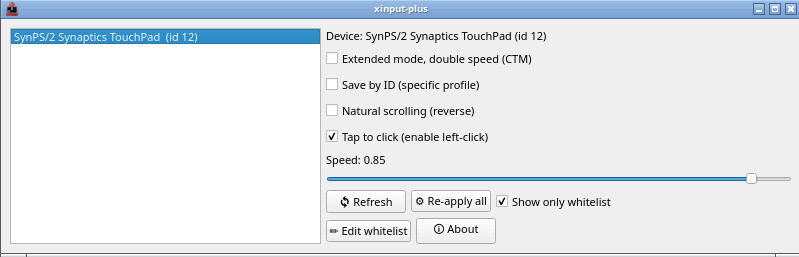
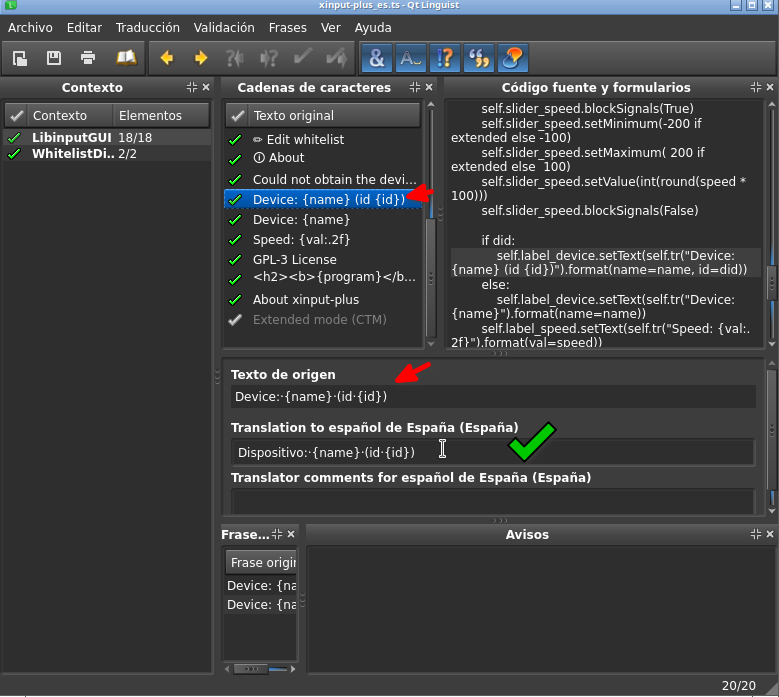

# 🖱️ xinput-plus

## Adjust your mouse or touchpad speed (very easy!)

This program is for **Linux** and allows you to **change the pointer speed** (mouse or touchpad cursor) graphically for use in X11 Window Managers such as: Openbox, JWM, iceWM, Fluxbox, and other minimalist window managers where there's no GUI program to do this, without having to type complicated commands. It's ideal if you use external keyboards that come with **integrated touchpad keyboard**, like the **Logitech K400**, or even for your laptop's touchpad if you feel the cursor moves too slowly.

---

## What is it for?

- ✅ Increase or decrease mouse or touchpad speed.
- ✅ Save configuration so it doesn't get lost when restarting.
- ✅ Works with devices like:
  - Keyboards with touchpad (e.g.: Logitech K400)
  - USB mice
  - Laptop touchpads

---

## 🖥Requirements

Before using it, make sure you have the following installed on your Linux computer:

```bash
sudo apt install xinput libinput-tools python3-pyqt6 python3-pyqt6.qtsvg
```

1. ⚠️ This program only works on **X11**, not on Wayland.  
2. It's only for X11 WM like Openbox, JWM, iceWM, Fluxbox, Xubuntu, etc
3. In 2025, for example in GNOME, KDE, before logging in you can select X11 to enter instead of Wayland.

---

## How to use the program

### **1st OPTION: Download the repository**
At:

[https://github.com/wachin/xinput-plus](https://github.com/wachin/xinput-plus)

click on the arrow-like dropdown in Code:

**<>  Code ▼**

and click on:

**Download ZIP**

decompress it, and there inside the folder is the `xinput-plus.py` file.

or you can clone it:

### **2nd OPTION: Clone the repository**

**1.-** Since we already have git installed, enter in a terminal in a folder where you have Linux programs:

```bash
git clone https://github.com/wachin/xinput-plus
```

**2.-** Give it execution permissions

It can be done by right-clicking in the **file manager** and in the "**Permissions**" tab verify that it's marked as executable

or from the terminal with:

```bash
chmod +x xinput-plus.py
```

## Running with Launcher.sh

Make sure the `scripts/Launcher.sh` script is executable, in the file manager right-click on it and in the "**Permissions**" tab make sure "**is executable**" is checked

Double-click the `scripts/Launcher.sh` script and click `Execute`

👉 A window will open:

## Running xinput-plus

**1.-** **Open a terminal**
**2.-** **Go to the folder** where the `xinput-plus.py` file is, or open a terminal there from your file manager
**3.-** **Run the program** with this command:

```bash
python3 xinput-plus.py
```

and it will open:



> 💡 On some Linux distributions you can right-click on the `xinput-plus.py` file and open with python.

---

## 🎛How to use it

1. When opening the program.
2. In the left list, **click on your device** (for example: "Logitech K400").
3. Use the slider to change the speed:
   - ← Slower (down to -1.0)
   - → Faster (up to 1.0 by default; up to 2.0 in extended CTM mode)
4. **Enable extra speed (optional)**: Check the box labeled "Extra speed (for slow devices)" to allow the slider to go up to 2.0, which provides significantly faster cursor movement for devices like the Logitech K400. This mode uses the `Coordinate Transformation Matrix` to scale pointer movement beyond the standard range.
5. The configuration saves automatically as you move the slider — no button press needed.

✅ Done! The change applies instantly and saves automatically. After restarting your computer, open the program and the saved settings (including extended speed mode) will be applied automatically.

---

## Where is the configuration saved?

The program saves your settings in this file (don't delete it if you don't want to lose the configuration):

```
~/.config/xinput-plus.json
```

If the `XDG_CONFIG_HOME` environment variable is set, the file is stored as
`$XDG_CONFIG_HOME/xinput-plus.json` instead.

---

## Using the system Dark Theme (Qt6 + Kvantum)

**xinput-plus** is a **PyQt6** app, so it follows your **Qt6** theme. To use a dark theme system-wide via **Kvantum**:

### Debian 12 (Bookworm)

1. **Install Qt6 theming tools**

```bash
sudo apt install qt6ct qt6-style-kvantum
```

2. **Select the style in Qt6 Settings**

* Open **qt6ct** → **Appearance / Style** → choose **Kvantum**.
* (Optional) Open **Kvantum Manager** and pick your favorite **dark** theme.

3. **Restart xinput-plus**
   No app changes are required—xinput-plus will automatically adopt the system dark theme.

> **Note (LXQt on Debian 12):** As you observed, **no environment variables** were needed—LXQt already exposes the Qt6 platform theme correctly.


### Other desktops / window managers

Some environments don’t expose the Qt6 platform theme by default. If the dark theme doesn’t apply after the steps above, set these **environment variables** (pick *one* place, e.g. your `Launcher.sh`, `~/.profile`, or the app’s `.desktop` file):

```bash
export QT_QPA_PLATFORMTHEME=qt6ct
export QT_STYLE_OVERRIDE=kvantum
```

Then log out/in or restart the app.

> **Heads-up:** `qt5ct` only affects **Qt5** applications. For **PyQt6/Qt6** apps like xinput-plus, you need **qt6ct** (and `qt6-style-kvantum`).

---

## How does it work internally?

It uses Linux commands with `xinput` to change the device speed in real time. For standard speed adjustments, it modifies the `libinput Accel Speed` property. For extended speed mode (up to 2.0), it uses the `Coordinate Transformation Matrix` to scale pointer movement, allowing higher sensitivity for devices that need it. The interface does everything for you!

---

## Building the .deb yourself (quick local method)

You can build the package directly on your Debian system (works on
Debian 12/13, MX Linux and derivatives). No chroot, no orig tarball —
one command builds the `.deb` and compiles the translations for you.

### 1) Install the build tools (once)

```bash
sudo apt install build-essential devscripts debhelper dh-python qt6-l10n-tools
```

What each package is for:

| Package | Purpose |
|---------|---------|
| `build-essential` | Compiler toolchain and `dpkg-buildpackage` |
| `devscripts` | Provides `debuild`, `dch`, `uscan` |
| `debhelper` | The helper suite that `debian/rules` drives |
| `dh-python` | Provides the `dh-sequence-python3` addon (`${python3:Depends}`) |
| `qt6-l10n-tools` | Provides the Qt 6 `lrelease`, which compiles the `.ts` → `.qm` translations during the build |

> Alternatively, with `deb-src` enabled in your sources, run
> `sudo apt build-dep .` from the project root and apt will install
> whatever `debian/control` declares.

### 2) Build the binary package

From the project root (the folder that contains `debian/`):

```bash
debuild -us -uc -b
```

- `-us -uc` — no GPG signing (fine for local use),
- `-b` — binary-only build; the orig tarball is **not** needed for this.

During the build you will see `lrelease` compiling the thirteen
`i18n/*.qm` translation files automatically. If everything goes well,
the last lines say:

```
dpkg-deb: building package 'xinput-plus' in '../xinput-plus_6.6.5-1_all.deb'.
```

The `.deb` is created **in the parent directory** (one level above the
project folder).

### 3) Check it with lintian (optional but recommended)

```bash
lintian -iIE --pedantic ../xinput-plus_6.6.5-1_all.deb
```

The goal is zero `E:` (error) lines. Until the ITP bug number replaces
the `#NNNNNNN` placeholder in `debian/changelog`, you will see two
known warnings about it — that is expected.

### 4) Install and test

```bash
# Install (apt resolves the dependencies automatically)
sudo apt install ../xinput-plus_6.6.5-1_all.deb

# Run it
xinput-plus

# Force a language, e.g. Spanish
xinput-plus --lang=es

# Read the man page
man xinput-plus

# Uninstall when done testing
sudo apt purge xinput-plus
```

### Rebuilding after changes

```bash
debian/rules clean
debuild -us -uc -b
```

If you change packaging files and want a new Debian revision number:

```bash
dch -v 6.6.5-2 "Describe your local change here."
debuild -us -uc -b
```

> **Why not `python3 xinput-plus.py` from the repo?** That works too and
> is documented above for users. The `.deb` installs the program as
> `/usr/bin/xinput-plus` (no `.py` extension, Debian Policy §10.4),
> compiles the translations, installs the icon, the `.desktop` entry,
> the AppStream metadata and the man page — and guarantees the
> dependencies are present. See
> [docs/where-python-programs-live-in-debian.md](docs/where-python-programs-live-in-debian.md)
> for the details of how Debian installs Python programs.

---

## Building and testing the .deb with pbuilder (clean chroot)

`pbuilder` builds the package inside a clean, minimal Debian unstable chroot —
the same way Debian's build servers do. If the build passes here, you can be
confident no build dependency is missing from `debian/control`.

### Install pbuilder

```bash
sudo apt install pbuilder
```

### Build steps

Run these commands from inside the project directory
(`~/Dev/xinput-plus-dev/xinput-plus`):

```bash
# 1. Create the pbuilder unstable chroot (only needed once)
sudo pbuilder create --distribution unstable

# 2. Create the upstream orig tarball (required by the 3.0 (quilt) source format)
tar --exclude=./debian --exclude=./.git --exclude=./__pycache__ --exclude="*.qm" --exclude="fix texts.txt" -czf ../xinput-plus_6.6.5.orig.tar.gz .

# 3. Build the source package
debuild -us -uc -S

# 4. Build the binary package inside the clean chroot
sudo pbuilder build --distribution unstable ../xinput-plus_6.6.5-1.dsc
```

After a successful build the parent directory (`~/Dev/xinput-plus-dev/`) will
contain:

```
xinput-plus/                        ← source tree
xinput-plus_6.6.5-1.dsc
xinput-plus_6.6.5-1.debian.tar.xz
xinput-plus_6.6.5-1_source.build
xinput-plus_6.6.5-1_source.buildinfo
xinput-plus_6.6.5-1_source.changes
xinput-plus_6.6.5.orig.tar.gz
```

The built `.deb` and related files are placed under pbuilder's result
directory:

```
/var/cache/pbuilder/result/xinput-plus_6.6.5-1.dsc
/var/cache/pbuilder/result/xinput-plus_6.6.5-1_all.deb
/var/cache/pbuilder/result/xinput-plus_6.6.5-1_amd64.buildinfo
/var/cache/pbuilder/result/xinput-plus_6.6.5-1_amd64.changes
/var/cache/pbuilder/result/xinput-plus_6.6.5-1.debian.tar.xz
/var/cache/pbuilder/result/xinput-plus_6.6.5-1_source.changes
/var/cache/pbuilder/result/xinput-plus_6.6.5.orig.tar.gz
```

### Install and test

```bash
sudo apt install /var/cache/pbuilder/result/xinput-plus_6.6.5-1_all.deb
```

Run the program:

```bash
xinput-plus
```

Force a specific language (e.g. Spanish):

```bash
xinput-plus --lang=es
```

Read the man page:

```bash
man xinput-plus
```

Uninstall:

```bash
sudo apt purge xinput-plus
```

---

## Developer documentation

The `docs/debian/` folder contains guides for developers who want to build,
test, or publish this package:

| Guide | Description |
|-------|-------------|
| [compile-and-test-deb.md](docs/debian/compile-and-test-deb.md) | How to build the `.deb` locally and test it on your machine |
| [how-to-publish-on-debian.md](docs/debian/how-to-publish-on-debian.md) | Full guide to getting the package accepted into packages.debian.org |
| [local-build.md](docs/debian/local-build.md) | Quick reference for local Debian builds |
| [packaging-guide.md](docs/debian/packaging-guide.md) | Debian packaging, mentors, and Salsa workflow |
| [watch-explained.md](docs/debian/watch-explained.md) | How `debian/watch` and `uscan` discover releases |
| [gpg-keys.md](docs/debian/gpg-keys.md) | GPG key setup for signing packages |
| [changelog-files-explained.md](docs/debian/changelog-files-explained.md) | The roles of the project and Debian changelogs |

---

## Want to improve this program?

This code is made in Python with PyQt6, perfect for students who want to learn about:
- Graphical interfaces
- Linux automation
- Hardware control

Feel free to modify it, improve it, or use it in your projects!

---

## Troubleshooting

### **"Permission denied" errors when running the program**

If the program not working when running from terminal you see errors like:

`Failed to open /dev/input/eventX (Permission denied)`

when running `xinput-plus.py`, it means your user lacks permission to access input devices. This is common in minimal Linux installations (e.g., Debian netinstall). To fix it:
    
1. **Add your user to the `input` group**:

```bash
sudo usermod -aG input $USER
```

   Log out and back in, or reboot, to apply the change.

2. **Verify permissions**:
   Check that `/dev/input/event*` files are accessible:
   
```bash
ls -l /dev/input/event*
```

   They should have group `input` and permissions like 
   
**Restart**

---

# Internationalization (i18n) Guide

This app supports translations with Qt **`.ts` → `.qm`** files. Follow these steps to add **any language** (Spanish shown as example).

---

## Requirements

* **Qt Creator** installed on your Linux OS
* **PyQt6 dev tools** (provides `pylupdate6`)

```bash
sudo apt install pyqt6-dev-tools
```
* Qt Linguist & lrelease (Qt 6 versions; the Qt 5 tools also work for `.ts` files):

```bash
sudo apt install qt6-l10n-tools
```

* Create the translations folder:

```bash
mkdir -p i18n
```

> The app loads compiled files from **`./i18n/`** (same directory as `xinput-plus.py`), e.g. `i18n/xinput-plus_es.qm`.

---

## Spanish example (es)

### 1) Extract source strings → `.ts`

```bash
pylupdate6 --ts i18n/xinput-plus_es.ts xinput-plus.py
```

### 2) Translate with Qt Linguist

* **From Qt Creator**: right-click `xinput-plus_es.ts` → open with Linguist → translate → mark entries as **Finished** → Save.
* **From terminal**:

  ```bash
  linguist i18n/xinput-plus_es.ts
  ```

### 3) Compile `.ts` → `.qm` in `i18n/`
You can do this from the "Qt Linguist" tool from Qt Creator by clicking on "File - Distribute As" and saving as .qm, or from terminal.

The package `qt6-l10n-tools` installs `lrelease` for Qt 6 (in `/usr/lib/qt6/bin/lrelease`):

```bash
sudo apt install qt6-l10n-tools
```

Then compile:

```bash
lrelease i18n/xinput-plus_es.ts -qm i18n/xinput-plus_es.qm
```

You should see output like:

```
Updating 'i18n/xinput-plus_es.qm'...
    Generated 21 translation(s) (21 finished and 0 unfinished)
```

If for some reason `lrelease` is not found, this fallback finds whichever
variant is available on your system:

```bash
LREL=$(command -v lrelease-qt6 || command -v lrelease || echo /usr/lib/qt6/bin/lrelease)
$LREL i18n/xinput-plus_es.ts -qm i18n/xinput-plus_es.qm
```

### 4) Run the app in Spanish

```bash
python3 xinput-plus.py --lang=es
```

---

## Any other language

Replace the language code:

```bash
# French (fr)
pylupdate6 --ts i18n/xinput-plus_fr.ts xinput-plus.py
linguist i18n/xinput-plus_fr.ts
$LREL i18n/xinput-plus_fr.ts -qm i18n/xinput-plus_fr.qm
python3 xinput-plus.py --lang=fr

# Brazilian Portuguese (pt_BR)
pylupdate6 --ts i18n/xinput-plus_pt_BR.ts xinput-plus.py
linguist i18n/xinput-plus_pt_BR.ts
$LREL i18n/xinput-plus_pt_BR.ts -qm i18n/xinput-plus_pt_BR.qm
python3 xinput-plus.py --lang=pt_BR
```

**File naming:** the loader tries common patterns like `xinput-plus_es.qm`, `xinput-plus_es_ES.qm`, and `xinput-plus_es-ES.qm`. Putting `xinput-plus_<lang>.qm` inside `./i18n` is sufficient.

---

## Important notes for translations

### 1) Use the canonical filename when extracting strings

The extraction command assumes your main file is named **`xinput-plus.py`**:

```bash
pylupdate6 --ts i18n/xinput-plus_es.ts xinput-plus.py
```

* **Do NOT** change `xinput-plus.py` to another filename while developing the program.
  During development, new UI strings are added frequently; if you point `pylupdate6` at some other file, those new strings **won’t** be picked up and **won’t** appear in the `.ts` for translation.
* If you really want to experiment with a differently named file (e.g., a versioned copy), do it in a **separate folder** and treat it as a separate exercise—not the one you use to develop and extract strings from.

**If you must use multiple source files**, pass **all** of them to `pylupdate6`:

```bash
pylupdate6 --ts i18n/xinput-plus_es.ts xinput-plus.py other_module.py optional_extras.py
```

This ensures every translatable string is included in the `.ts`.

---

### 2) Translating safely in Qt Linguist (placeholders!)

When you open the `.ts` in **Qt Linguist (Qt 5 Linguist)**, be careful with strings that include **placeholders**. You may **translate only the normal words**, **not** the placeholders inside braces.

**Examples:**

* Source text:

  ```
  Device: {name} (id {id})
  ```

  ✅ Correct translation pattern:

  ```
  [Translated word]: {name} (id {id})
  ```
  


  (translate only “Device”; keep `{name}` and `{id}` exactly as they are)

* Source:

  ```
  Device: {name}
  ```

  ✅ Correct translation pattern:

  ```
  [Translated word]: {name}
  ```

* Source:

  ```
  Speed: {val:.2f}
  ```

  ✅ Correct translation pattern:

  ```
  [Translated word]: {val:.2f}
  ```

> **Never change** the content inside `{ ... }` (names, formats, punctuation).
> If you alter `{name}`, `{id}`, or `{val:.2f}`, the program won’t work correctly at runtime.

---

### 3) Compile after translating

After updating translations in Linguist (and marking them as **Finished**),
compile to `.qm`. On Debian/MX Linux, use `lrelease` from `qttools5-dev-tools`
(it handles Qt6 `.ts` files just fine — `lrelease-qt6` is not needed):

```bash
lrelease i18n/xinput-plus_es.ts -qm i18n/xinput-plus_es.qm
```

If `lrelease` is not found, install it first:

```bash
sudo apt install qttools5-dev-tools
```

If you need a fallback that works across different systems:

```bash
LREL=$(command -v lrelease-qt6 || command -v lrelease || echo /usr/lib/qt5/bin/lrelease)
$LREL i18n/xinput-plus_es.ts -qm i18n/xinput-plus_es.qm
```

or you can compile from Qt 5 Linguist  

File - Distribute as...

and save example to: xinput-plus_es.qm

Then run the app:

```bash
python3 xinput-plus.py --lang=es
```

also you can launch in other languages, example:

```bash
python3 xinput-plus.py --lang=en
```

You should see Spanish UI and, on recent versions, a console line like:

```
[i18n] Loaded app translation: xinput-plus_es.qm
```

---

## 4) Keeping the .ts file clean after source changes

Whenever you rename, remove, or reword a UI string in `xinput-plus.py`,
the old string becomes **obsolete** in the `.ts` file. Qt Linguist marks
it as `vanished` but cannot delete it — you have to do that from the
command line.

**Step 1 — Regenerate the `.ts` and discard obsolete entries:**

```bash
pylupdate6 --no-obsolete --ts i18n/xinput-plus_es.ts xinput-plus.py
```

The `--no-obsolete` flag removes any string that no longer exists in the
source. Without it, `pylupdate6` keeps old entries forever.

You will see a summary like:

```
Summary of changes to i18n/xinput-plus_es.ts:
    21 existing messages were found
    3 obsolete messages were discarded
```

**Step 2 — Translate any new strings that appeared:**

After regenerating, open the `.ts` in Linguist and look for entries marked
as **unfinished** (shown in yellow). These are strings that were added or
changed in the source and have no translation yet. Translate them and mark
them as **Finished**.

Alternatively, you can add translations directly in the `.ts` file by
changing:

```xml
<translation type="unfinished" />
```

to:

```xml
<translation>Your translation here</translation>
```

**Step 3 — Recompile:**

```bash
lrelease i18n/xinput-plus_es.ts -qm i18n/xinput-plus_es.qm
```

The output should show **0 unfinished**:

```
Updating 'i18n/xinput-plus_es.qm'...
    Generated 20 translation(s) (20 finished and 0 unfinished)
```

> **When to do this:** run `pylupdate6 --no-obsolete` before every release,
> or any time you change a UI string in the Python source.

---

## Developer note

* Source strings in `xinput-plus.py` are wrapped in `self.tr("…")` so `pylupdate6` can extract them.
* The app’s i18n loader **keeps `QTranslator` references alive** to avoid Python GC, ensuring translations apply from startup.

---

## About this program

Created by: **Washington Indacochea Delgado**
License: **GNU GPL3** (free and open source)

✨ Thanks for using `xinput-plus`!  

For those who love X11 and minimalist window managers. 👀💙

---

> 🌟 If it helped you, give it a star ⭐ on GitHub. It helps a lot!

God bless you
